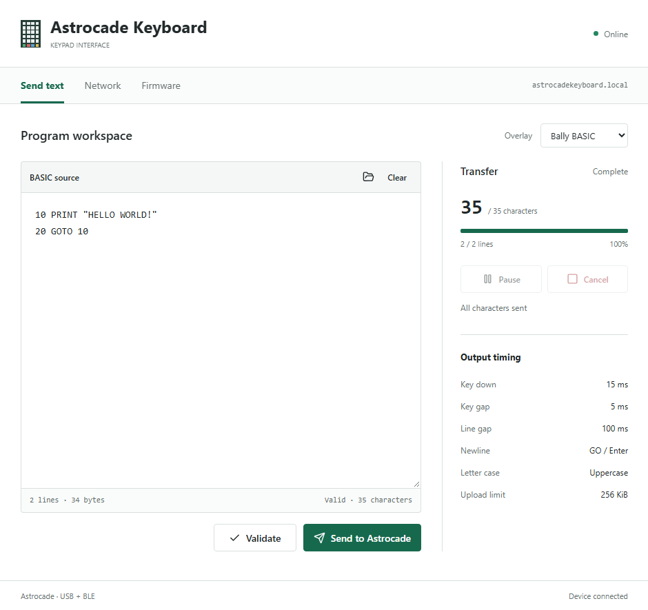

# Pictures to Supply

Place the real images in this folder with these exact filenames. No dummy PNGs
or invented hardware pictures are included. Use clear, readable PNGs and redact
personal networks/keys. The public default credentials may be shown if labeled.

| Filename | What to capture |
|---|---|
| `web-example.png` | Send text page with a short BASIC example and progress |
| `network-example.png` | Network page showing the SSID dropdown and connection status |
| `ota-example.png` | Firmware page with firmware.bin selected or update progress |
| `esp32-model.png` | Board front/back, module N8R2 marking, both USB connectors labeled |
| `wiring-diagram.png` | Full wiring matching WIRING.md, IC notch/pin numbers, resistors, power/ground/reset |
| `proto-board.png` | Your completed prototype with the ESP32 and crosspoint visible |
| `terminal-example.png` | Boot notices: USB/BLE ready, AP details, IP and mDNS |
| `usb-otg-jumper.png` | Close-up of the tested board's OTG bridge, with orientation and board revision |
| `bally-example.png` | Optional: the connected Bally running a small transferred BASIC program |

Prefer 1280-1600 pixel wide screenshots/photos, without unrelated desktop UI.
For wiring use enough resolution to read every label; include the editable
diagram source too if you have it. Only use images you own or can redistribute.

After adding an image, embed it in the relevant local wiki page with:

```markdown

```

From the root README the path is `docs/images/web-example.png`. Image locations
are marked in wiki comments. See `docs/PUBLISHING.md` before copying pages into
GitHub's separate Wiki repository, where relative image paths differ.
